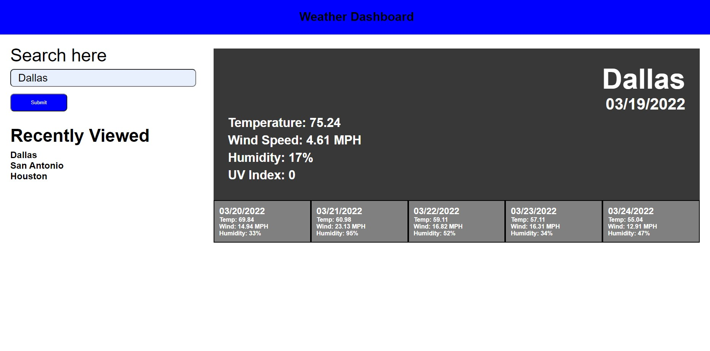

# Weather Dashboard

## Description
In this project My goal was to create an application that would pull current and future weather info from the Open Weather API. Users can enter a city name in the search bar and when they click search or hit enter it will search that city in the API and display the appropriate info in the designated fields.

## Screenshot

## Link
https://matt4292.github.io/weather-dashboard/